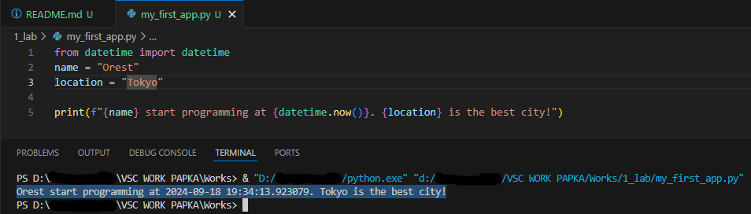

# Звіт до роботи №1
## Тема: _Вступ та оформлення робіт_
### Мета роботи: _Налаштувати локальне середовище розробки, створити Github репозиторій, оформлення робіт з використанням форматування Markdown_

---
### Виконання роботи
* Результати виконання завдань:
    1. Налаштували Visual Studio Code для роботи з Github;
    1. Створили репозиторій [Works](https://github.com/OGRuban/Works);
    1. Попрацювали з форматуванням Markdown та заповнили початкову сторінку;
    1. Почали оформляти першу роботу:
        - створили [файл з розширенням py](./my_first_app.py) та скопіювали тест програми та запустили програму.
        - Результат виконання програми представлений на скріншоті
        
    1. Програма вивела текст.

---
### Висновок:
* У цій роботі ми досягли своєї мети, виконавши всі завдання та отримали нові знання, тобто: налаштували локальне середовище розробки, створили Github репозиторій, оформили роботу з використанням форматування Markdown. Складнощів у виконанні завдання не виникло.

---